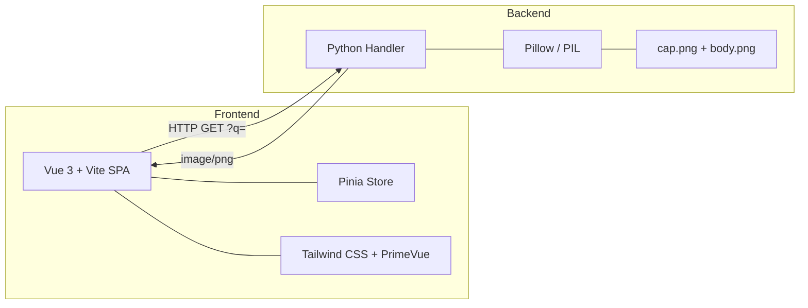
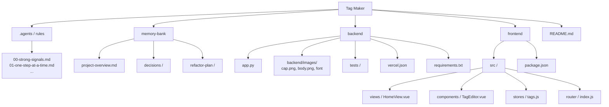

# Tag Maker

A web app for creating tag/badge-style images (like Discord tags or presentation labels). Built with a Vue 3 frontend and Python backend, deployed on Vercel.


## Architecture



- **Frontend:** Vue 3 + Vite + Pinia + Tailwind CSS + PrimeVue
- **Backend:** Python serverless function (currently `BaseHTTPRequestHandler`, planned migration to FastAPI)
- **Image generation:** Pillow (PIL) compositing of PNG assets with custom text and colors
- **Live API:** `https://discord-tagger.vercel.app/?q=[...]`

## Live Demo

Visit [discord-tagger.vercel.app](https://discord-tagger.vercel.app/) and add some tags — the preview updates live as you edit.

## Project Structure



## Getting Started

### Backend

```bash
cd backend
pip install -r requirements.txt
python app.py   # Run the handler locally (via Vercel dev or standalone)
```

### Frontend

```bash
cd frontend
npm install
npm run dev     # Serves at http://localhost:5173
```

## API

```
GET /?q=[{"text":"Hello","bg":"#40a6ceff","color":"#ffffffff"},...]
```

Returns a composited PNG of all tags arranged in rows, wrapping at 1536px width.

Parameters per tag object:
| Field   | Type     | Default           | Description                |
|---------|----------|-------------------|----------------------------|
| `text`  | `string` | `"Hello, world"`  | The tag label text         |
| `bg`    | `string` | `#40a6ceff`       | Background color (hex)     |
| `color` | `string` | `#ffffffff`       | Text color (hex)           |

## Refactoring Plan

This project is undergoing a planned refactoring. See the [refactor plan](./memory-bank/refactor-plan/) for details. The key steps are:

1. Resolve package manager conflicts
2. Consolidate duplicate tag-generation logic
3. Add unit tests
4. Migrate to FastAPI (with input validation via Pydantic)
5. Restructure backend directory
6. Improve frontend code quality
7. Add CI pipeline